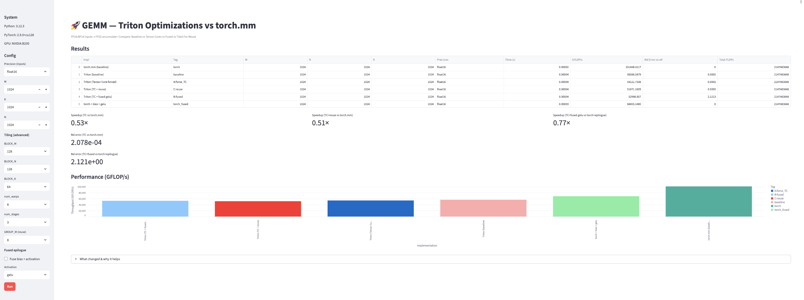

# GEMM — Triton vs PyTorch Benchmark

Hey guys - Not an expert here. Here is an educational benchmarking tool to explore how different parameters affect matrix multiplication (GEMM) performance between a **custom Triton kernel** and **PyTorch’s built-in GEMM**, evaluated on **NVIDIA B200**.

The Triton GEMM was mostly taken from : https://triton-lang.org/main/getting-started/tutorials/03-matrix-multiplication.html#sphx-glr-getting-started-tutorials-03-matrix-multiplication-py

## Features
- Compare **Triton vs PyTorch** GEMM throughput  
- Toggle **Tensor Core usage**, **tiling**, and **pipeline stages**  
- Enable **fused bias + activation** inside the kernel  
- Visualize results in a Streamlit dashboard (GFLOP/s, latency, relative error)

## Parameters that impact performance
- **Precision**: `float16`, `bfloat16`, `float32`  
- **Tile sizes**: `BLOCK_M`, `BLOCK_N`, `BLOCK_K`  
- **Compute scheduling**: `num_warps`, `num_stages`, `GROUP_M`  
- **Fusion**: Bias and activation fused into the GEMM kernel  
- **Reuse / Grouped mapping / Pipeline**: Improves cache locality and overlap of load+compute

## Run
```bash
python3 -m venv venv
source venv/bin/activate
pip3 install -r requirements.txt
streamlit run gemm_benchmark_tritonvstorch.py
```

## What it should look like !


## License
Under MIT License, see LICENSE